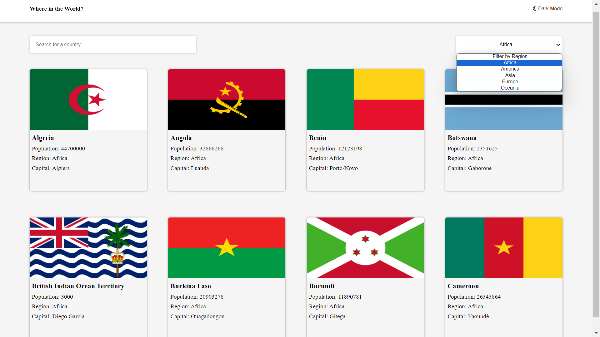
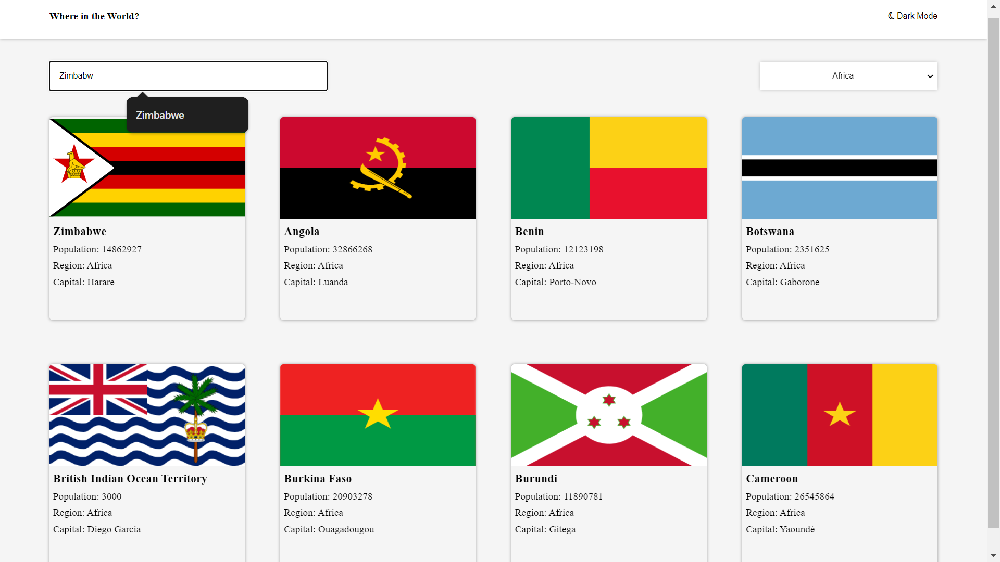
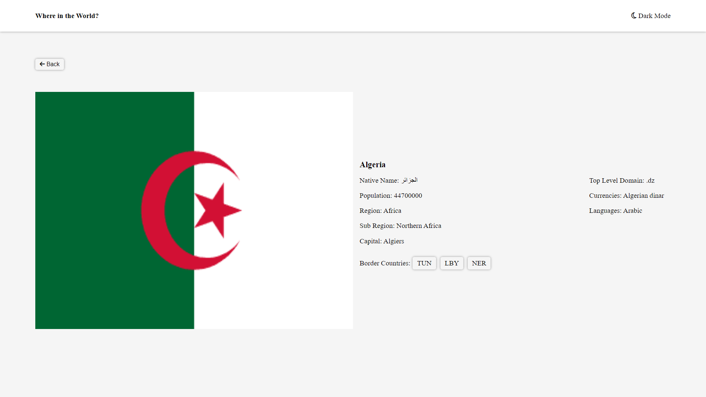

# Frontend Mentor - REST Countries API with color theme switcher solution

This is a solution to the [REST Countries API with color theme switcher challenge on Frontend Mentor](https://www.frontendmentor.io/challenges/rest-countries-api-with-color-theme-switcher-5cacc469fec04111f7b848ca). Frontend Mentor challenges help you improve your coding skills by building realistic projects.

## Table of contents

- [Overview](#overview)
  - [The challenge](#the-challenge)
  - [Screenshot](#screenshot)
  - [Links](#links)
- [My process](#my-process)
  - [Built with](#built-with)
  - [What I learned](#what-i-learned)
  - [Continued development](#continued-development)
  - [Useful resources](#useful-resources)
- [Author](#author)
- [Improvements](#Improvements)

## Overview

### The challenge

Users should be able to:

- See all countries from the API on the homepage
- Search for a country using an `input` field
- Filter countries by region
- Click on a country to see more detailed information on a separate page
- Click through to the border countries on the detail page
- Toggle the color scheme between light and dark mode _(optional)_

### Screenshots

### Links

- Live Site URL:

## My process

### Built with

- CSS custom properties
- Vanilla Javascript
- HTML

### What I learned

- HTML DOM and elements manipulation using Javascript
- Use of EventListeners eg change(for input), click, keyup
- Getting elements by class, Id or value
- Using fetch function and use of localStorage(setItem and getItem) to use the data outside the fetch function
- Filtering Data
- Dynamic updating of components

### Continued development

Thinking in terms of scalability prior to starting the project regardless of project size e.g (should have made use of one dynamic card instead of 8 in html)

## Author

- Website - [Tapiwa Chimbwanda](https://tapiwa.me/)
- Frontend Mentor - [Tapiwa Chimbwanda](https://www.frontendmentor.io/profile/Civil-t)
- Twitter - [@Tapiwa\_\_C](https://x.com/Tapiwa__C)

## Improvements

- Unfinished detailed (dark mode text color)
- Html card elements can be rendered dynamically
- Then display all countries in the API
- View in detail searched country when clicked
- Click on border countries

